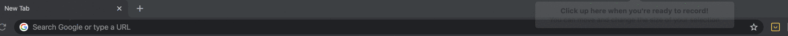

# Smile IO Chrome Extension

## Installation
---
### Download this repo
Using either a relevant `git clone` command or the Github UI.
### Enable Chrome Developer Extensions
- Navigate to `chrome://extensions`
- In the top right corner, flip the switch to enable Developer Extensions`
### Load Unpacked Extension
- After enabling developer extensions, you can load unpacked extensions at `chrome://extensions`
- Navigate to the directory where you downloaded this repo and select the folder.
### Enjoy
Navigate to [Pin Point.Apparel](https://pinpoint.life/) to check out the extension.

---
## Usage
---
While the extension is detecting Smile on your site, you will see the Smile icon beside your chrome address bar. Once the extension has completed checking you will see a solid Smile logo if Smile is successfully installed:

Or if Smile is not detected you will see a sad Smile logo:

### Success
If Smile is successfully installed you will see a button to open panel, for those times when launcher is hard to find (the button will match the merchant's branding colour!). You will also have a link to the merchant in Internal:

### Unavailable
If Smile is unavailable, the extension will tell you which part of the Smile panel code is missing (ie the `div` isn't on the page, or the Smile JS isn't loading).

_Note: If the Smile Div is unavailable, the extension will not be able to generate a link to Internal._

